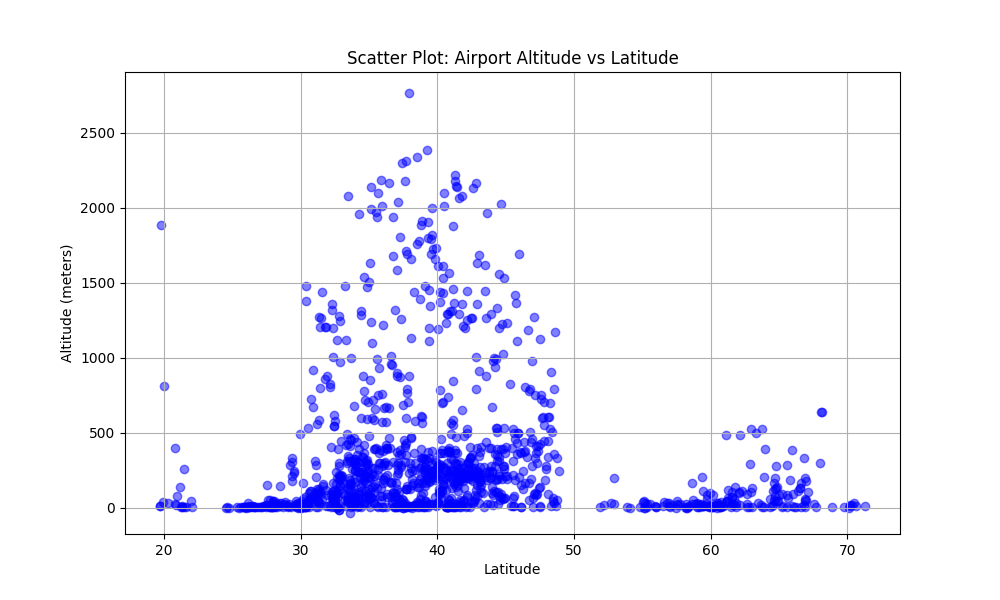

# Data Engineering - Project Report

## Project Group Members
- **A. Lis (Adel), **
- **M. Taciak (Monika), **
- **N. Micek (Nikolina), **
- **Y. Yan (Yoyo), yyn480**

---

## Dataset Overview
This dataset contains **information on all destination airports** for flights departing from **New York City in 2023**.  
Each row represents a **destination airport** where a flight from NYC landed. The dataset includes key details such as:
- **FAA code** (Three-letter airport code)
- **Airport name**
- **Latitude & Longitude** (Geographical coordinates)
- **Altitude** (Airport elevation in feet)
- **Time zone** (UTC offset)
- **Daylight saving time (DST) usage**

Since all flights originate from New York City airports, we checked the map and found that only EWR is included among NYC airports. This means that every flight in the dataset originates from EWR (Newark Liberty International Airport), not JFK or LGA.

---

## Libraries Used
The following Python libraries were used in this project for **data processing, visualization, and geospatial analysis**:
- `pandas` – For reading and processing the dataset.
- `plotly` – For interactive visualizations.
- `geopy` – For geographic distance calculations.
- `matplotlib` - For descriptive statistics
- `timezonefinder` - For inferring the missing value
- ``

### Descriptive Statistics
```python
print("missing values in each column:\n", df.isnull().sum()) 
```
missing values in each column:
 faa        0
name       0
lat        0
lon        0
alt        0
tz        48
dst       48
tzone    119

No missing values in FAA codes, airport names, coordinates, and altitude.
Missing tz (time zone offset) and dst (daylight saving time info) in 48 rows.
tzone (time zone name) missing in 119 rows, which may impact time-based analysis.

Since tz (UTC offset), dst (Daylight Saving Time), and tzone (time zone name) are related, we can infer their missing values instead of dropping them. This will help retain more data and improve the accuracy of our analysis.

After inferring the missing values, we used various charts and graphs to analyze patterns and relationships between different attributes in the dataset.



